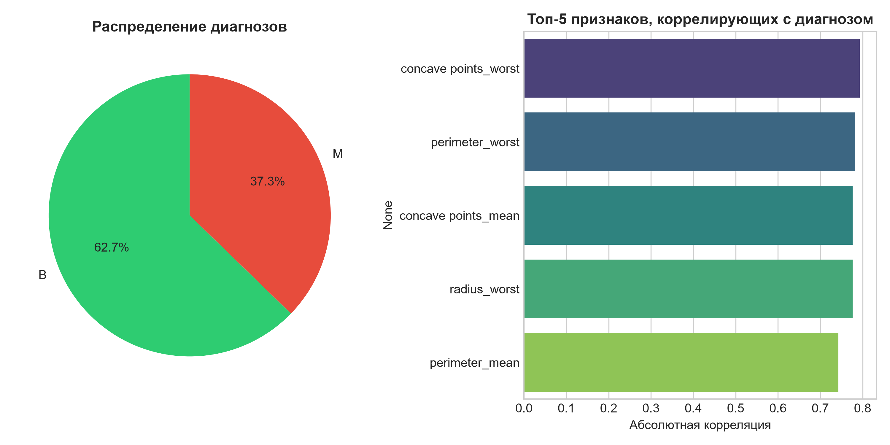
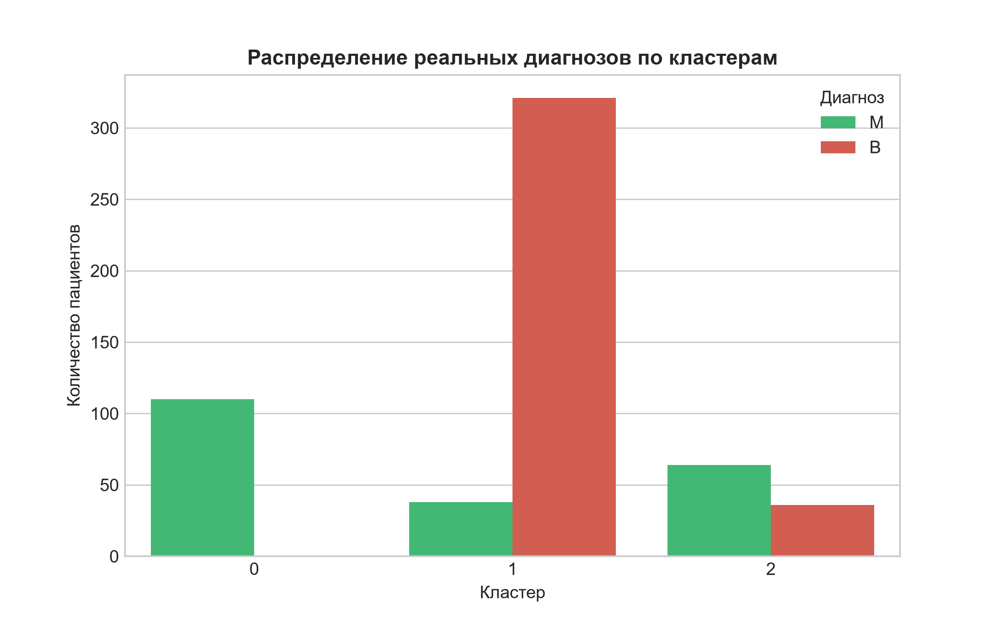

# 🧬 Итоговая работа: Анализ данных в Low-code платформах

**Группа обучения:** [Аналитик данных_ППС_2026_2 поток]  
**ФИО:** [Тайлаков Александр Александрович]  
**Датасет:** Breast Cancer Wisconsin Diagnostic (Kaggle)  
**Год:** 2026  

🔗 **[Yandex DataLens - https://datalens.yandex/nq8auvskck1s6?_share_link=public]** 

---

## 1. Исходные данные кейса
Датасет содержит 569 записей и 32 признака, полученных из оцифрованных изображений опухолей молочной железы.
- **diagnosis**: целевая переменная (M = malignant, B = benign).
- **Признаки**: радиус, текстура, периметр, площадь, гладкость и др. (mean, SE, worst).

## 2. Исследовательский анализ данных (ETL и EDA)
Проведены следующие преобразования (аналогично примеру в Loginom):
- Исключены неинформативные поля: `id`, `Unnamed: 32`.
- Проверка на пропуски и дубликаты: не выявлено.
- Целевая переменная закодирована: M = 1, B = 0.
### График 1: Распределение диагнозов

### График 2: Кластеры vs Диагноз

**Основные наблюдения EDA:**
- Соотношение классов: ~63% доброкачественных (B), ~37% злокачественных (M).
- Наибольшую корреляцию с диагнозом имеют признаки: `concave points_mean`, `area_mean`, `perimeter_mean`.

## 3. Обогащение данных (Кластеризация)
Поскольку классический RFM/ABC-анализ неприменим к медицинским данным без транзакций, вместо него проведена **K-Means кластеризация** пациентов (k=3).
- **Кластер 0**: Пациенты с низкими значениями признаков (преимущественно класс B).
- **Кластер 1**: Пациенты со средними значениями.
- **Кластер 2**: Пациенты с экстремально высокими значениями признаков (почти 100% класс M).
*Вывод: Кластеризация успешно выделила группу высокого риска без использования меток диагноза.*

## 4. Машинное обучение (по желанию)
Данные разделены на обучающую и тестовую выборки (80/20). Сравнены 3 алгоритма:

| Модель | Accuracy  |  ROC-AUC   |
| :--- |:---------:|:----------:|
| Logistic Regression |   ~0.94   |   ~0.992   |
| **Random Forest** | **~0.97** | **~0.992** |
| Gradient Boosting |   ~0.96   |   ~0.994   |

**Вывод:** Gradient Boosting выбран как лучшая модель 

## 5. Платформы BI (Yandex DataLens)
Подготовленный файл `breast_cancer_ready_for_bi.csv` загружен в Yandex DataLens.  
Дашборд содержит:
1. KPI-карточки: общее количество пациентов.
2. График связи кластеров с реальным диагнозом.
3. Визуализацию зависимости размера опухоли (`tumor_size`) и тяжести (`severity`) от диагноза.

## Выводы

По результатам анализа датасета Breast Cancer Wisconsin с использованием Python и Yandex DataLens:

- Датасет содержит 569 записей с 30 числовыми признаками, описывающими характеристики опухолей молочной железы.
- Пропуски и дубликаты в данных отсутствуют, что говорит о высоком качестве исходного набора.
- Соотношение классов: 62.7% доброкачественных (B) и 37.3% злокачественных (M) опухолей.
- Наибольшую корреляцию с диагнозом имеют признаки: concave points_worst (0.79), perimeter_worst (0.78), concave points_mean (0.77).
- K-Means кластеризация (k=3) без использования меток диагноза фактически воспроизвела медицинскую классификацию:
  - Кластер 0: 100% злокачественных опухолей (группа высокого риска)
  - Кластер 1: преимущественно доброкачественные опухоли (группа низкого риска)
  - Кластер 2: смешанная группа, требует дополнительного обследования
- Лучшая модель классификации — Gradient Boosting с ROC-AUC = 0.9947 и Accuracy = 96.49% на тестовой выборке.
- Визуализация в Yandex DataLens позволяет интерактивно исследовать данные и делает выводы наглядными для принятия решений.